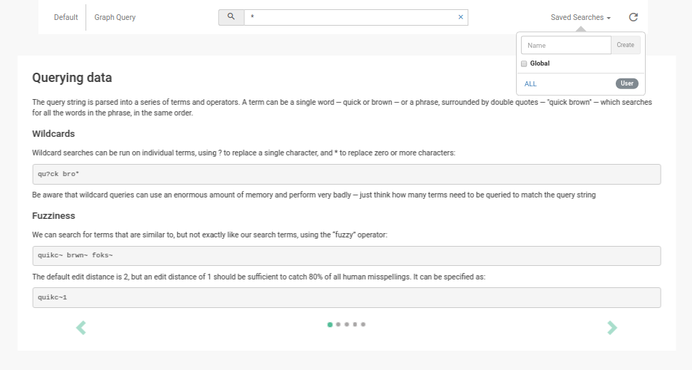

# Discovering your data

In the previous section we have seen some of the basic functionalities that BigConnect has to offer, but we have barely interacted with the actual data that it holds.

This section will describe the **Discover** tab present on the navigation bar. This is where one can start obtaining real insights in the available data.

Landing on this tab we will be greeted with the following:


In the center of the screen we can find the query analyzer that currently supports Lucene like or Cypher syntaxes. Below, depending on the selection, we are presented with a nice how to displaying some of the most used patterns. For a quick demo we could simply use the **\*** wildcard retrieving all available data and paginating it, but in real life scenarios we could end up writing very complex queries.  The following is a Cypher query matching the customer named **Demo**  and retrieving some details about its orders.


```text
MATCH (demo:Customer {name:'Demo'})-[rel:PURCHASED]-(order:Order)
RETURN order.orderId AS OrderID, order.orderDate AS `Purchase Date`,
       demo.customerIdNo AS CustomerID, order.orderNumOfLineItems AS `Number Of Items`
```

Running the above query once could suit our purpose, but maybe we want to save it for later and re-run it. As we saw earlier the **Dashboard** has specialized widgets that could link to a **Saved Search** and display the data every time we visit the welcome page. In order to save a query one has to first write the query in the search box and then click **Saved Searches.**


One can now set a meaningful name. In our case performing a full data search the name could simply be **ALL**. If one wants this query to become globally available then simply check also the **Global** **checkbox**. Otherwise directly click the **Create** button.



After saving it, when clicking the **Saved Searches** we can now find the **ALL** query available. 

* If one clicks the query name then it will be executed and the data, if any, made available. 
* If one wants to delete the query then simply hover it and click on the **Delete** button.

A simple query result using our saved search could look like this:


The result list includes 4 **Person** entities and a **City** entity. To the right we can find a **Refinements** pane that can help us quickly hide certain results. If we click on the **Person** concept then we get the following output:


The **City** concept is now hidden and the active filtering using the **Person** concept can be seen above the result list with green. In the **Refinements** pane we have no additional quick filters to apply.

